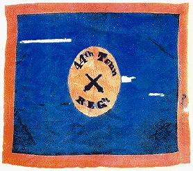
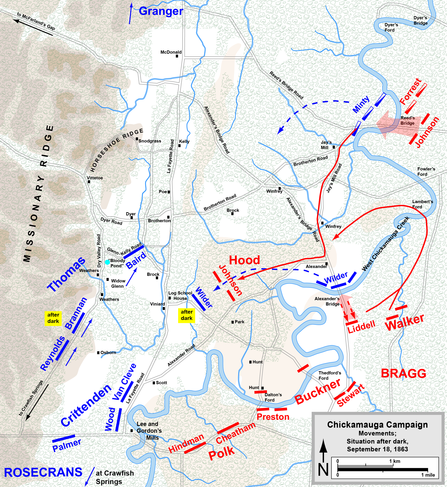
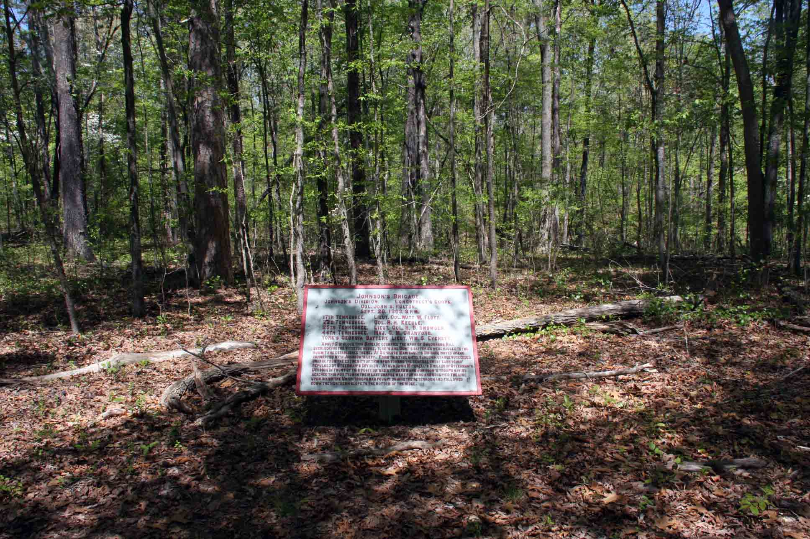
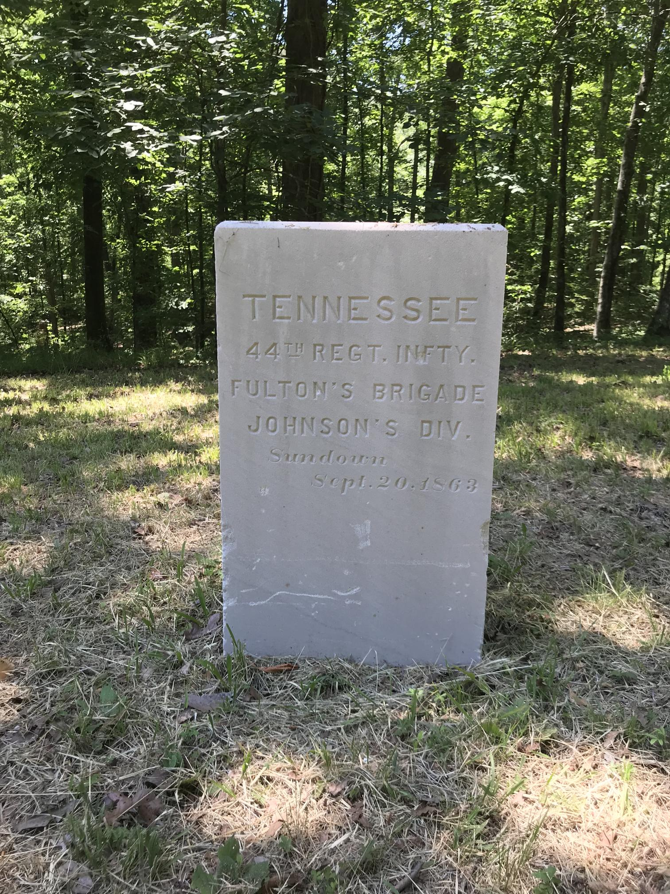

http://www.tngenweb.org/grundy/cwar/regs/44thteninfreg.html  
http://freepages.rootsweb.com/~grundyconnections/military/final44.html  
http://www.tennessee-scv.org/4455/TN55.txt  
https://upload.wikimedia.org/wikipedia/commons/c/cf/Chickamauga_Sep18.png  
https://www.findagrave.com/memorial/25361424/mary-ann-dozier  
https://www.ancestry.co.uk/boards/surnames.williams/14421.1.1/mb.ashx  
https://www.genealogy.com/ftm/d/o/z/Lisa-M-Dozier/WEBSITE-0001/UHP-1276.html  
https://thereevesproject.org/data/tiki-index.php?page=Reeves_Mary_Ann_1934  
https://www.amazon.com/Historical-Tennessee-Infantry-Regiment-Regimental/dp/1546746714  

# A History of Joseph Thomas Dozier.

## Family History

Joseph Thomas Dozier, one of eleven children of Jr Dozier Zachariah and Cintha Ann Johnson, was born February 8, 1829. He was married to Mary Ann Reeves (fifth child of Absolum Reeves and Elizabeth Wheeler Reeves).  His sister, Arabella (Aril) Dozier married Mary Ann's borther, Nathaniel Reeves.  Joseph and Mary Ann resided in Bedford County, Tennessee.  They had six children: Arie, Caldonia, William Franklin, Zachariah, Elliott Lafayette, and Josephine.  Joseph was wounded in Murfreesboro and was home on leave when Josphine was conceived.  When his regiment came through, he rejoined them with a still wounded knee.  Joephine Dozier was born after her father died.  Mary Ann Reeves Dozier was born Feb 23, 1833 and died April 21, 1909.  She is buried in the Reeves/Wheeler family Cemetery near Shelbyville, TN.

  + Arie Dozier
  + Caldonia Dozier (born 1843).
  + William Franklin Dozier (born November 25 1855 and died Mar 11 1929).
  + Zachariah Dozier (born 1857).
  + Elliott Lafayette Dozier (born between 1857 and 1861).
  + Josephine Dozier (born February 19, 1864).

Josephine Dozier married Newton Thompson and had the following children:

  + Elliot Thompson.
  + May Thompson.
  + Winfred Thompson.
  + Frank Thompson.
  + Claudia Thompson.
  + Alma Thompson.
  + Mary Thompson.
  + Annie Thompson.

## Civil War History

  

Dozier was a sergent in Bound's company of the Tennessee Infanty 44th Regiment.

Tennessee Infantry, 44th Regiment was organized at Camp Trousdale December 16, 1861; Composed of men from Coffee, Grundy, Franklin, Lincoln and Bedford County.  Captain Williamson C. Haggard led “H” Company from Bedford Country.  It later consolidated with “I” to form “A” company.

Consolidated with 55th (McKoin’s) Tennessee Infantry April 18, 1862 to form 44th Consolidated Tennessee Infantry; reorganized May 5, 1862; field consolidation with 25th Tennessee Infantry October, 1863; paroled at Appomattox Courthouse April 9, 1865.

Colonels: John H. Kelly, John S. Fulton
Lt. Colonel: John L. McEwen, Jr.
Majors: John S. Fulton, Henry C. Ewin, Gipson M. Crawford.

Captain: Samuel J. Warner, "G" Company (also called "B"). A consolidation of Bound's and Duggan's companies of 55th Regiment. 

-- As excerpted from Tennesseeans in the Civil War

  

As part of this division the brigade was engaged in the Battle of Shiloh April 6-7, 1862. General Wood, in his report, stated the 44th entered the battle with 250 muskets. Doctor Noblitt, Assistant Surgeon for the regiment, said in his account in Lindsley's Annals, that the 44th entered the engagement with 470 men in line, and at roll call Tuesday morning, April 9, 120 answered to their names. Colonel McDaniel and Lieutenant Colonel Shied were both wounded, and Major Johnson had been absent from the regiment for some time because of illness.  As a result, on April 18, 1862, the 44th was permanently consolidated with the 55th (McKoin's) regiment which had also suffered heavy losses, to form the 44th Tennessee Infantry Regiment Consolidated, or the 44th Tennessee Infantry, 2nd Organization. 

From Charleston the regiment moved to Chickamauga, Georgia on September 8, and was engaged in the Battle of Chickamauga September 19-20, 1863, as part of General Johnson's Provisional Division. Here Colonel Fulton was in command of the brigade, and the 44th reported 113 casualties out of 294 engaged, including Lieutenant Colonel McEwen who was wounded. Prior to the battle 56 barefoot men had been sent to the rear. 

  

This plaque marks Johnson’s Brigade location on Sunday 20, 1863 at 3:00 PM.  There are seven monuments to the Johnson’s Brigade on the battlefield. (N 34° 55.652 W 085° 16.506)

    Johnson’s Brigade
    Johnson’s Division, Longstreet’s Corps.
    Col. John S. Fulton.
    Sept. 20, 1863, 3 P.M.

    17th Tennessee,           Lieut. Col. Watt W. Floyd.
    23d Tennessee,            Col. R. H. Keeble.
    25th Tennessee,           Lieut. Col. R. B. Snowden.
    44th Tennessee,           Maj. G. M. Crawford.
    York’s Georgia Battery,   Lieut. Wm. S. Evertt.

_About 2 o’clock this Brigade occupied the spur of Snodgrass Hill overlooking the Vittetoe House. York’s and Dent’s batteries were hauled to the summit and established there. At 3 o’clock Manigault’s Brigade moved up and connected with Johnson’s left. From this time until sundown charge succeeded charge from the extremity of this spur towards the central crest each being repulsed by Steedman’s Division. At sundown Mitchell’s Brigade of Steedman’s Division in front of this position was withdrawn and Johnson’s troops having reached this position in the last charge went forward and occupied the line upon which the Union troops had fought during the afternoon and followed down the northern slope to the bottom of the ridge._

  

---

'''
AUGUST 16-SEPTEMBER 22, 1863.--The Chickamauga Campaign.
No. 414.--Report of Col. John S. Fulton,
Forty-fourth Tennessee Infantry, commanding Johnson's brigade.

HEADQUARTERS JOHNSON'S BRIGADE,
September 30,1863.

SIR: I have to report the action taken with the enemy by the Forty-fourth, Twenty-fifth, Twenty-third, and Seventeenth Tennessee Regiments, composing this brigade, and Company E, of the Ninth Georgia Artillery Battalion (a battery of two howitzers and two small rifled pieces), commanded by First Lieut. W. S. Everett, in an affair at and from Ringgold to Chickamauga Creek, on the l7th and 18th instant, and at the battle of Chickamauga, on the 19th and 20th instant:

By order from Brigadier-General Johnson this brigade moved at 3 p.m. on 17th instant, from its encampment, 3 miles south of Ringgold, on the Ringgold and Dalton road, in the following order: Twenty-fifth, Forty-fourth, Twenty-third, and Seventeenth Tennessee Regiments. On our approaching Ringgold a supply train on its way to Ringgold had been reversed and was rapidly returning. At this juncture, I received an order from General B. R. Johnson to form the brigade in line of battle at the foot of Taylor's Ridge and throw forward skirmishers to hold Ringgold. The Twenty-fifth Tennessee Regiment being in front, took position on its right flank to protect the wagons rapidly moving to the rear. The brigade was formed in line of battle at the foot of Taylor's Ridge, the Forty-fourth and Twenty-fifth Tennessee Regiments on the right of the road, Twenty-third and Seventeenth Tennessee Regiments on the left. A company from each regiment was sent in charge of Major Davis to hold Ringgold, with a detachment of Scott's cavalry on my flanks. A section of the battery was placed on my extreme right on elevated ground, where I ordered it to open upon the enemy's battery posted on the hill above and to the northwest of Ringgold, which had fired 2 shots into the town. After firing 8 rounds I dislodged the enemy, who was pursued by Colonel Scott's cavalry with a section of Everett's battery, 6 miles. He (Colonel Scott) having reached their encampment, a few rounds of grape and canister were fired among the enemy's camp fires, when Colonel Scott, with the section of artillery, retired.

The brigade rested on their arms in line of battle during the night. Rations were cooked and in haversacks by daylight on the morning of the 18th instant, when we took up line of march to Leet's Tan-yard. After marching a short distance the line of march was changed. The regiments countermarched and followed the enemy in the direction of Chattanooga, and having reached Peeler's (overshot) Mill we found that the enemy were near us. The brigade was formed in line of battle and skirmishers thrown forward, together with the left wing of the Forty-fourth Tennessee Regiment, under General Forrest, followed by the right of that regiment, under Lieutenant-Colonel McEwen, jr. Lieutenant Everett fired a few rounds on the enemy, under direction of General Forrest. The skirmishers of the Seventeenth Tennessee Regiment engaged the cavalry pickets of the enemy, killing 3 men and mortally wounding 1.

The enemy's skirmishers having been driven back, the Twenty-fifth, Twenty-third, and Seventeenth Regiments were moved forward, <ar51_472> crossing Pea Vine Creek some 600 yards from our first position into and over a corn-field, where these regiments were drawn up in line of battle. The enemy had taken his position in the corn-field opposite, running to a high ridge near the junction of the Graysville and La Fayette, Ringgold and Chattanooga roads. A section of the First Missouri Battery (Bledsoe's) having been placed in position on my left by Generals Johnson and Forrest, in rear of the Seventeenth Tennessee, the Forty-fourth was now brought to the right of the Twenty-fifth Tennessee Regiment. The firing from this battery drove the enemy from his position, and after shelling the woods in our front I again received an order to advance in line of battle.

My skirmishers were kept deployed at a distance of 200 yards, which distance they kept, passing over the ridge (a strong position) and forward to Reed's Bridge, across which the enemy had moved and taken position in the woods beyond. Before reaching the bridge (Reed's) the Seventeenth Tennessee was detached and sent by General Forrest to the left to attack a force of the Federals at their principal encampment. Before gaining this position, however, the enemy fled. The skirmishers of the Twenty-third Tennessee while approaching Reed's Bridge became engaged, and the Twenty-third Tennessee Regiment voluntarily pushed forward with a yell and drove the enemy from the bridge before it could be destroyed. Here the Twenty-third Tennessee had 5 men wounded, 1 of whom (Private A. Melton, color bearer), when obliged to give up his colors, called upon his successor to carry them forward ahead of everything else.

Skirmishers were immediately sent over the bridge and deployed, followed by the Forty-fourth, Twenty-fifth, and Twenty-third Tennessee Regiments, which filed to the right some 300 or 400 yards through a corn-field. The enemy now opened a battery upon the bridge, one of its shells wounding Lieutenant Hastings, of the Seventeenth Tennessee, which regiment was returning to rejoin the brigade and crossed over the bridge under the enemy's fire of artillery. A section of First Missouri (Bledsoe's) Battery, of the reserve artillery, opened fire and drove the enemy's battery from its position.

The brigade moved forward in line of battle, changing direction to the right, and moved in line to Alexander's Bridge, where we were halted and remained for brigade on our left (Gregg's) to come up. Gregg's brigade moved forward, followed by Johnson's, [from] which, after marching some 600 yards, the Forty-fourth Tennessee was detached to guard our wagon train. Having marched some 2½ miles by the flank, Gregg's brigade became engaged with the enemy. We changed front forward on left company, left battalion, amid moved up on line with other troops on our left, and rested on our arms during the night, one-third of the men being required to be awake and skirmishers deployed in our front.

Saturday, September 19, early this morning a detail of intelligent men was made, five from each regiment, to reconnoiter the enemy's line. They reported to me about 10 a.m. the enemy 1¼ miles distant and in our front. The Forty-fourth Tennessee took its position on the right of the brigade, and the line of the brigade conformed to that of Gregg's on our left, and Robertson's on our right, which encompassed the top of a low ridge. The firing commenced on our right about 8 a.m., and continued along the line until Cheatham became engaged.

About 1 p.m. the skirmishers of the Seventeenth Tennessee, as <ar51_473> well as those of Gregg's brigade, were driven in. A general engagement was now commenced on our left, the left companies of the Seventeenth Tennessee participating by firing obliquely to the left. At this time Everett's battery was placed behind the extreme left of the Seventeenth Tennessee, the fire of which drove the enemy back at this point.

Shortly after the command to move forward was given, the left regiment to touch to the right until we reached the road, when the right would move slowly, that the left may come up on the road, thus to change direction slightly to the right; but this order was not fully carried out. We did not advance exceeding 700 yards when the enemy opened fire upon us and we became hotly engaged. The enemy had planted a battery which struck about the center of the Forty-fourth Tennessee Regiment, and which opened upon our advancing lines, throwing in rapid succession grape and canister, and supported by infantry, whose fire of small-arms was heavy, well-directed, and disastrous.

The entire brigade now became hotly engaged (during this engagement Major Lowe, of the Twenty-third Tennessee, was wounded), which lasted nearly an hour, the enemy making a stubborn resistance, gradually retiring, he having advantage of both undergrowth and ground, but finally was driven across the Chattanooga and La Fayette road. The Seventeenth Tennessee Regiment, on approaching the road, was halted and opened fire on the enemy in its front, distant about 200 yards in a woodland. The undergrowth having been cut out, the enemy were in full view. The Forty-fourth Tennessee was still engaging the enemy. The Twenty-fifth and a portion of the Twenty-third Tennessee Regiments crossed the road (the other portion of the Twenty-third being with the Seventeenth Tennessee) and gained the cover of the woods and moved to the flank of the enemy's battery (still firing upon the right of our line) at right angles with my present line, gaining a fence, under which they opened fire. Delivering several volleys, [we] ceased firing, reloaded, and charged the battery, driving the enemy's gunners from their guns and killing several horses. The caissons were moved off by the enemy, leaving their pieces on the field. The Seventeenth Tennessee and the other portion of the Twenty-third Tennessee had crossed the road, having driven the enemy. The Seventeenth Tennessee here lost 1 officer killed, 2 officers and about 20 men wounded.

In this engagement the Forty-fourth Tennessee suffered heavily, sustaining a loss in killed and wounded.

A portion of Robertson's extreme left (Texans) and part of the Forty-fourth Tennessee had been driven back, but about two-thirds of the Forty-fourth Tennessee crossed the road.

Here Lieutenant-Colonel McEwen, jr., 5 company officers (Captain Jackson one of the number), and 50 men were wounded and 6 men killed, among the latter Sergt. T. A. Johnson, color bearer, one of the bravest of the brave. Lieutenant-Colonel McEwen, jr., however, remained with his command after he was wounded Until obliged to retire from exhaustion.

Lieutenant-Colonel Tillman, of the Forty-first Tennessee, Gregg's brigade, rode up to me at this time, stating that the enemy was moving down the road to my left and would soon be in my rear. Doubting the report, I suggested that our lines were connected on our left and that a flank or rear movement could not, therefore, be made by the enemy. I, however, found that but two regiments of <ar51_474> Gregg's brigade had moved up with my line, and they had retired. Lieutenant-Colonel Tillman had thus lost sight of his regiment, and in company with him and Lieutenant-Colonel Floyd I started to the road to satisfy myself as to the correctness of this report. I had gone but a short distance when I discovered a column of the.enemy moving by the flank in direction of the Seventeenth Tennessee Regiment, which rapidly gained its rear. I heard distinctly the commands "halt," "front," and immediately their fire was pouring upon our flank and rear. Here a general stampede ensued, so sudden and unexpected was the movement. We fell back 200 yards in rear of the Chattanooga and La Fayette road and reformed.

In this flank movement of the enemy, the Seventeenth Tennessee Regiment lost 11 officers, including their gallant major (Davis), who was wounded, and about 60 men taken prisoners.

The brigade built temporary breastworks, behind which it remained during the night in line of battle. Our skirmishers, under Major McCarver, were directed to occupy the Chattanooga and La Fayette road, but this could not be done, the lines on my right and left not conforming thereto. I, however, instructed them to be posted within 50 yards of the road.

Sunday, September 20.--This morning my line connected on the right with McNair's (Gregg being in the next line in our rear) and General Hindman's on the left. Everett's battery took position between my left and the right of Hindman.

Shortly after 9 a.m. the skirmishers, under direction of Lieuten-ant-Colonel Ready, fell back to the breastworks, bringing those of the enemy after them. A well-directed fire from the Forty-fourth Tennessee drove the enemy's skirmishers back, leaving many of his dead in our front. My skirmishers were sent forward and very soon they became again engaged, the enemy using his artillery.

About 10 a.m. a general advance was ordered. The left of the brigade had advanced but a short distance before it became engaged with the enemy, the battle having commenced some three hours earlier on the right. The Seventeenth Tennessee recrossed the Chattanooga and La Fayette road, where it engaged the enemy. The whole line crossing the fence, the engagement became general. Here we passed a house and garden and through an open field. It was here that Lieutenant-Colonel Ready, of the Twenty-third Tennessee, was wounded while rushing forward.

On entering the house, cribs, &c., many prisoners, both officers and men, were captured, and here some fine swords were taken from the enemy. Among the prisoners was the colonel of the One hundredth Illinois Regiment. The enemy's breastworks, which had been built at intervals along his line, offered but a poor assistance to the enemy to resist our advance, which was not only vigorous and spirited, but irresistible. We found he had a second line of breastworks, about 80 yards in rear of the first, made of logs and rocks, behind which they scarcely halted. Having driven the enemy from his first position, we halted and reformed our line in front of a dense, low, pine thicket. Pressing forward we carried this position, the dead of the enemy showing how good a protection he had calculated on. We passed through a stubble wheat-field to a ravine until we reached the edge of a long open field, the upper side of which being a bald hill or high ridge, upon which the enemy had a heavy battery of nine guns firing upon the advancing line on our right.

Without delay the field was entered and charged across, and the <ar51_475> ridge or bald hill was gained, the troops on our right having flanked and silenced the enemy's battery, which was captured. Everett's battery was immediately brought up, together with Dent's, which were opened upon the enemy's retreating wagon train, moving on the Chattanooga and Crawfish Spring road.

I sent forward skirmishers to reconnoiter the hollow beneath, where was found the enemy's telegraph running up the Chattanooga and Crawfish Spring road, several hundred yards to our right. This telegraph was cut down and several prisoners captured; among the prisoners a staff officer of Major-General Van Cleve and one of General Rosecrans' escort, with their horses and equipments. The effect of our batteries was fine, the enemy rapidly retreating.

A mounted officer was dispatched to the troops on our left (who had not kept pace with us) with a flag to show and direct them to our position. They had already opened one of their batteries upon our position, having taken us for the enemy. Their battery was playing upon us from the second hill on our left.

Having received orders to move to the hollow beneath, we here changed direction to the right, which threw the line almost perpendicular to the former. This done I marched forward, entering a corn-field. Here we began to see the fruits of our rapid and continuous movements. Three 12-pounder brass field pieces and three caissons were here captured, and nine 4-horse wagons, one of which, with 4 mules attached, was immediately sent to the rear. Three of these wagons were laden with ordnance, the others with commissary and quartermaster's stores. Some of the wagons were capsized, so utter was their confusion. I immediately found that my left flank was exposed and sent forward a heavy line of skirmishers to cover both my left flank and front, and advanced the brigade to the hillside and there halted. I also sent forward a party to reconnoiter the front in advance of the line of skirmishers, who, after absence of an hour, reported the enemy about 1 ½ miles distant and advancing.

In the meantime, I had learned of the enemy having skirmishers, or that occasional shots were fired from the hill on my left, running almost at right angles with the one on which I was then resting. I sent immediately a company of skirmishers to reconnoiter the hill. A few prisoners were brought in.

In the corner of the field below my present position was the Vidito house, where the enemy had practiced many outrages. The ladies were found lying under the floor of the house, and when they saw the enemy retreating and our line advancing they broke from their concealment, shouting and clapping their hands for joy.

A delay of an hour occurred While waiting the movement of some troops to our left, under orders from General B. R. Johnson. During this time, however, a portion of Dent's and Everett's batteries were placed in position in front of the brigade, and we replenished our cartridge boxes from the enemy's three wagons laden with ordnance, which had been captured here.

Between 1 and 2 p.m. I advanced to the top of the hill, when we were again upon the enemy, who opened a heavy fire upon us. Our batteries and small-arms here were engaging the enemy some fifteen minutes, when our line fell back some 15 paces under cover of the hill, Gregg's command on my right, giving back at the same time, this no doubt having started the backward movement. Just at this time the two brigades (Deas' and one other) were marching in line <ar51_476> of battle by the Vidito house to connect with our lines on the left, they changing direction to the right for this purpose. A general advance was ordered and our batteries opened simultaneously. The firing was heavy, and the enemy's massive columns were hurling against our wearied heroes. Again our line fell back. Two brigades now came up in our rear. One of these brigades moved in advance of us, and receiving the enemy's fire fell back behind us again.

My line was again ordered forward, the enemy being within 50 yards of the batteries and but one piece firing. Here commenced a most desperate struggle for the possession of this ground--Mission-ary Ridge.

The battle raged furiously and the tide of success wavered in the balance. Charge after charge was repulsed, only to rally and charge again. Again our line fell back, and the untiring, indomitable, and determined officers rallied again their fast thinning ranks and again moved forward. Here officers and men behaved most gallantly. Appeals to love of home and wounded comrades and the peril of the moment were made, and never did men rush forward more eager, daring, desperate, and defiant. The enemy's treble lines now began to show that our fire was terribly effective upon them.

Our cartridge boxes had been replenished as required, and still we were nearly out. Again more ammunition was supplied and the conflict continued hot and heavy. The enemy was now slowly giving back, hard pressed by our now shattered remnants. Another charge, with the yells of the men and cheers of the officers, and forward we pressed, only to discover the victory was ours and the enemy in full retreat.

This series of engagements lasted four long hours, during which Johnson's brigade won many laurels and an imperishable name. At this moment another brigade came up and was loudly cheered forward, but the enemy made no resistance. Our ammunition being (with but few exceptions) exhausted, the brigade halted and reformed, moved forward, about faced, marched back some distance, and formed on Manigault's line. Here we sent forward pickets to cover our front, and several prisoners were brought in.

The men rested on their arms during the night, having on this day won a victory, one of the most glorious of the war. In this engagement Everett's battery fired very effectively, being in the thickest of the fight. This evening he had 1 sergeant and 2 men wounded and 5 horses shot down by the enemy. During this engagement with the enemy this morning, while firing on the enemy's wagon train, he dismounted one piece of the enemy's artillery. He fired 428 rounds during the four days' fight. I commend the officers of this battery to favorable consideration for their fidelity and good conduct while under fire.

I have also to notice the services of Lieutenant Dent, commanding Robertson's battery, whose fire upon the enemy was incessant and effective, both officers and men behaving most coolly and gallantly during the day.

I have great pleasure in attesting to the gallant and efficient conduct of the following officers: Lieutenant-Colonel McEwen, jr., commanding Forty-fourth Tennessee Regiment (wounded); Lieutenant-Colonel Snowden, commanding Twenty-fifth Tennessee Regiment; Colonel Keeble, commanding Twenty-third Tennessee Regiment ; Lieutenant-Colonel Ready, of Twenty-third Tennessee Regiment <ar51_477> (wounded); Major Lowe, of Twenty-third Tennessee Regiment (wounded); Lieutenant-Colonel Floyd, commanding Seventeenth Tennessee Regiment, and Major Davis, of Seventeenth Tennessee Regiment (wounded and captured). Adjutants Cross, Gwyn, and Fitzpatrick, and Lieutenant Greigg, who came into the action on Sunday morning; also Captain Terry, who, after he was wounded on Saturday evening, rendered me valuable service on Sunday.

Mention may also be made of the following: Private (ex-captain) Ridley, of Twenty-third Tennessee, who went into the action and fought manfully with a gun, setting a good example to all; Lieutenant Vernon, of Company B, Twenty-third Tennessee, for the manner in which he bore himself.

On entering the action this command numbered as follows, viz:

Command           Officers     Men      Aggregate

44th Tennessee      28           266           294
25th Tennessee      25           120           145
23d Tennessee       28           153           181
17th Tennessee     27           222           249
Battery                ....           ....               85
Total                   ....           ....             954

The numbers of the different regiments of this command were thus small, the barefooted men having been sent to the rear, by order from division commander, as follows: Forty-fourth Tennessee, 56 men; Twenty-fifth Tennessee, 23 men; Twenty-third Tennessee, 26 men; Seventeenth Tennessee, 120 men and 2 officers. Aggregate, 227. My loss was as follows:

Command      Killed.      Wounded.      Captured and missing.      Aggregate

44th Tennessee 10                88                     15                          113
17th Tennessee ....                61                     69                          130
23d Tennessee   8                77                     13                            98
25th Tennessee 10                45                     1                             56
Battery           ....                  3                     ....                             3
Total              28                274                    98                          400

I have much pleasure in stating that there was no straggling, either by officers or men. I have also great satisfaction in noticing the medical appointments of this brigade for promptness and efficiency. The care and treatment of the wounded by Dr. Jackson, Forty-fourth Tennessee, acting brigade surgeon; Dr. Slummer and Dr. Harris, of Twenty-third Tennessee; Dr. Jones, of Seventeenth Tennessee, and Drs. Fryar and Jackson, of Twenty-fifth Tennessee. I also return my thanks to Dr John Ganaway who volunteered his services and rendered himself useful in a high degree. I think I may say that the wounded of this brigade received attention second to no other brigade in the army commanded by General Bragg. <ar51_478>

I have to report the following capture of ordnance and ordnance stores:

Enfield Rifles (in train)                                     300
Guns, different calibers, stacked on field                 2,200
Total                                                               2,500

Enfield cartridges, caliber .577 (in train)                 69,000
Enfield cartridges issued from enemy's wagons        35,000
Piled with small-arms                                           50,000
Total                                                                154,000

musket
http://www.geocities.com/pentagon/Quarters/1864/enf/enfblue.htm

Of the wagons captured this day, 9 (4-horse) were secured to this brigade, 1 with team for ordnance train. Also 3 wagon loads of accouterments.

Lieutenant Lake, in charge of the division ordnance train, has made the foregoing report to me. The pro rata of this capture is due to Johnson's brigade, viz:

Enfield rifles                                         100
Guns, different calibers, stacked on field     733
Total                                                  833

Enfield cartridges                                         23,000
Enfield cartridges issued from enemy's wagons    11,666
Piled with small-arms                                    16,667
Total                                                         51,333

And 1 wagon load of accouterments.

I have also to enumerate 3 brass 12-pounder cannon, 3 caissons for 12-pounder cannon, captured on the field on Sunday evening by this brigade, as mentioned in this report, I of which was hauled to the rear by Lieutenant Everett, commanding my battery, attached. I would also state that 21 of the above guns was manned by men (artillerists) from the Seventeenth and Twenty-third Tennessee Regiments, and used under direction of Lieutenant Dent with good effect on the enemy during the four hours' contest on Sunday evening.

I have also to mention Ordnance Sergt. J. F. Baxter, wounded on the field. This man is an untiring officer, and faithful to his trust.

The provost guard, under Lieutenants Ewing and Orr, rendered invaluable service.

I am pleased to notice the conduct of Private Turner Goodall, of the provost guard, who, in the thickest of the fight on Sunday evening, seeing the men all so gallantly at work and hard pressed, came up with his gun and fought manfully through the hottest of the fight, and by words of encouragement to his fellow soldiers and example did his whole duty as a soldier and provost guard.

The capture of prisoners by this brigade in the two days' fight exceeds 600 men and officers sent to the rear.

I would also mention Lieutenant Ewing, of the provost guard, from the Seventeenth Tennessee Regiment, who, finding that the officers of his company had all been placed hors de combat, asked permission and returned to take command of his company on Sunday morning. He is a worthy and promising officer.

I have to report the following articles captured from the enemy and secured by Dr. John W. Templeton for the use of the brigade: <ar51_479> One 2-horse spring ambulance; 70 dozen bandages; 2 pounds opium; and other medicines; 1 dozen sets splints.

Dr. Templeton is the hospital steward of the Forty-fourth Tennessee Regiment.

Respectfully submitted.

JNO. S. FULTON,
Colonel, Commanding Johnson's Brigade.

Capt. W. T. BLAKEMORE,
Acting Assistant Adjutant-General.
'''
